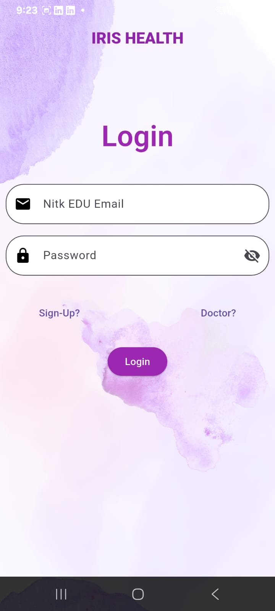
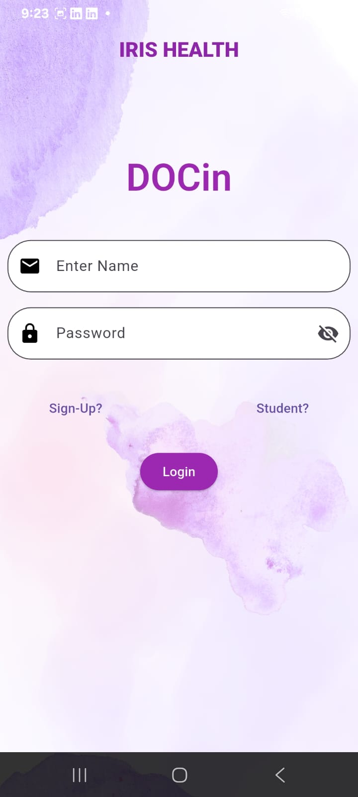
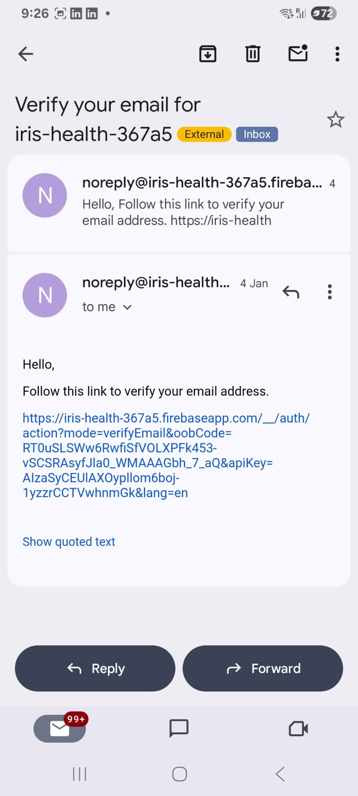
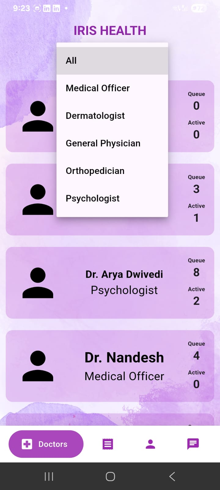
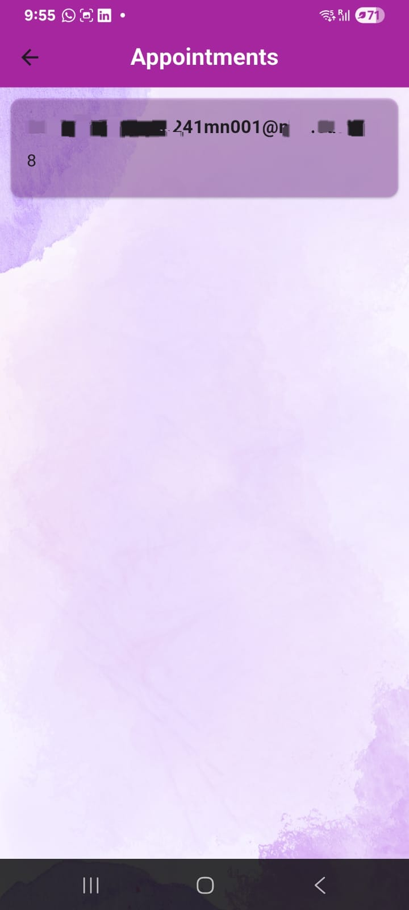
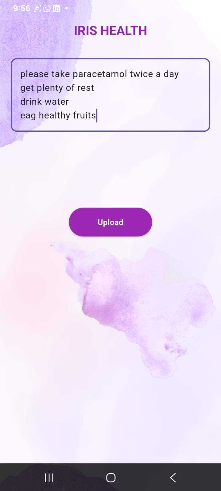
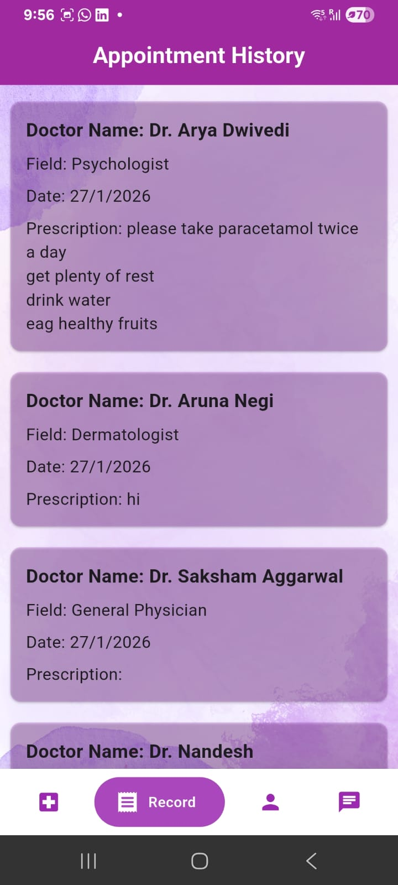
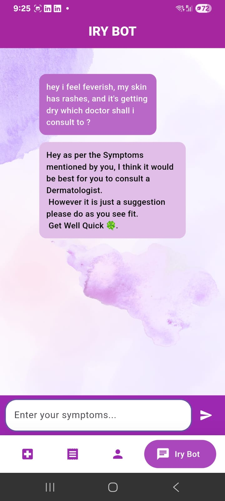

🌿 IRIS HEALTH

🏥 Smart Campus Health Management System
Built with Flutter, Dart & Firebase

  

🚀 About The Project

IRIS HEALTH is a role-based healthcare management application built for campus environments.

It enables seamless interaction between:

🎓 Students

🩺 Doctors

Students can book and track consultations, while doctors can manage queues and provide prescriptions — all powered by Firebase.

🎯 Key Features
👩‍🎓 Student Side

Secure Email Authentication

View Available Doctors

Live Queue Tracking

Appointment History

View Prescriptions

AI-based Doctor Suggestion (IRY Bot)

🩺 Doctor Side

Secure Role-Based Login

View Assigned Patients

See Patient Names in Queue

Write & Submit Prescriptions

Update Consultation Status

📱 App Screens
🔐 Authentication System

   

Email & Password Login

Role-based routing

Firebase Authentication integration

📧 Email Verification (Firebase Auth)

  

Secure account activation

Prevents fake registrations

👨‍⚕️ Doctors Dashboard

   

Filter by specialization

Live queue count

Active consultations

🧑‍⚕️ Doctor – View Patients

  

Doctors can:

View patient names

See their position in queue

Access consultation details

📝 Doctor – Write Prescription

  

Doctors can:

Type medical prescriptions

Submit updates to Firestore

Instantly reflect data in student history

👤 Student Profile

  

View consultation count

Unique student ID

Logout securely

📜 Appointment History

  

Doctor name

Specialization

Date

Prescription notes

🤖 IRY BOT – Smart Medical Assistant

  

Users describe symptoms and receive specialist suggestions.

Example:

“I feel feverish and have skin rashes”
→ Suggestion: Dermatologist

🏗️ Tech Stack
Technology	Usage
Flutter	Cross-platform UI
Dart	Application Logic
Firebase Authentication	Secure Login
Cloud Firestore	Real-time Database
Firebase Email Action Links	Email Verification
🧠 Architecture Overview
Flutter UI
     ↓
Firebase Authentication
     ↓
Cloud Firestore
     ├── Users Collection
     ├── Doctors Collection
     ├── Appointments Collection
     ├── Prescriptions Collection
     └── Queue Management

🔥 What Makes This Project Strong

✔ Two-Sided Role-Based System
✔ Real-Time Firestore Updates
✔ Doctor-to-Student Data Flow
✔ Prescription Management System
✔ Secure Authentication Flow
✔ Clean & Consistent UI
✔ Chatbot Feature Integration

🛠️ Installation
git clone https://github.com/your-username/iris-health.git
cd iris-health
flutter pub get
flutter run

Firebase Setup Required

Add google-services.json

Enable Email/Password Authentication

Configure Firestore Database

Apply Firestore Security Rules

📂 Required Assets Structure
/assets
   splash.jpeg
   login_student.jpeg
   login_doctor.jpeg
   email_verification.jpeg
   doctors_list.jpeg
   filter_specialization.jpeg
   doctor_patients.jpeg
   write_prescription.jpeg
   profile.jpeg
   history.jpeg
   iry_bot.jpeg

🚀 Future Enhancements

Push Notifications

Time-slot based appointment booking

Doctor availability scheduling

Admin dashboard

AI-powered chatbot upgrade

Analytics dashboard

👨‍💻 Author

Abhishek Dwivedi
Flutter & Firebase Developer
